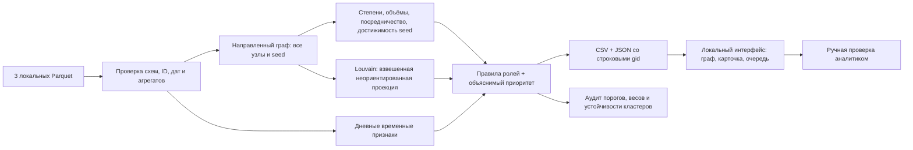

# Архитектура решения

Вычислительный слой отделён от визуализации. run.py объединяет расчёт, сборку и локальный HTTP-сервер. Пороговые правила находятся в rules.py, расчёты и экспорт — pipeline.py, аудит — audit_model.py. Интерфейс не отправляет транзакции внешним API.

Каждая роль — гипотеза с основаниями. Ограничения наблюдения сохраняются в карточке и экспорте, решение о проверке остаётся за аналитиком.
